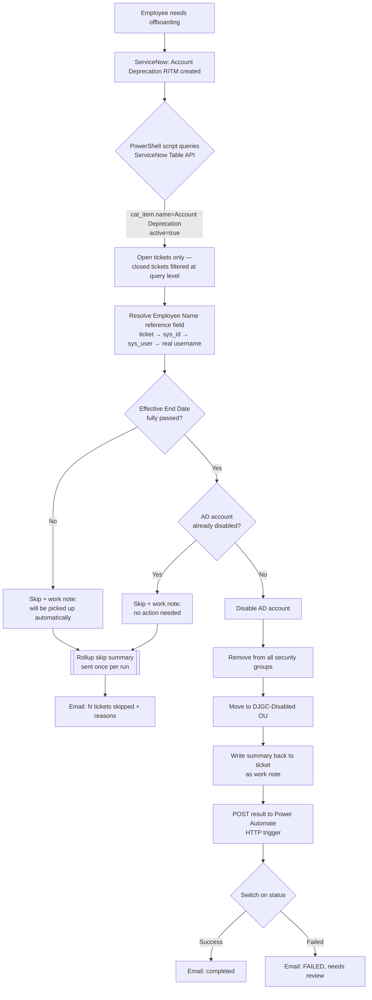

# DJGC Enterprise Lab — Identity, Licensing & Offboarding Automation

A self-built enterprise IT lab simulating a mid-size company (**DJ Group of Companies**, fictional — four divisions, 25 employees), built to practice real Microsoft-ecosystem administration and automation, end to end: Active Directory design → security groups & licensing → ServiceNow-integrated offboarding automation using the ServiceNow Table API and PowerShell → a Power Automate notification layer that closes the "did it actually work" gap.

This isn't a tutorial-following exercise — every design decision below was made deliberately, tested, and in a couple of cases, revised after hitting a real wall. Those walls are documented too, not hidden.

## Why this exists

I'm building toward being a **Business Technology Builder** — someone who solves business problems using the Microsoft ecosystem, automation, and systems thinking, not just someone who knows individual tools. This lab is Phase 1 (Identity) and Phase 4 (Automation) of a longer personal roadmap: design and build a realistic company environment, then automate a real operational process end to end, the same way it would work in production.

## Architecture

**Design principle:** every branch writes back to the ticket. Nothing fails silently — a human reviewing the ticket always knows exactly what the automation did or didn't do, and why. The notification layer mirrors this: Success, Failed, and Skipped are three distinct, correctly-routed outcomes, not a single pass/fail flag.

## What's in this repo

| Path | What it is |
|---|---|
| `docs/Identity_Design.md` | Full AD identity design doc — OU structure, security group model, naming convention, and the reasoning behind each decision |
| `docs/DJGC_License_Roster.md` | License tier (E3 / F1 / PowerBI) assignment logic, mapped to role |
| `scripts/New-DJGCUsers.ps1` | Builds 25 users from a CSV roster into the correct OUs and security groups |
| `scripts/New-DJGCLicenseGroups.ps1` | Creates license-tier security groups and assigns all users based on role |
| `scripts/New-DJGCServiceNowUsers.ps1` | Seeds matching `sys_user` records in ServiceNow so ticket reference fields resolve to real users, the same way production reference fields work |
| `scripts/Invoke-DJGCOffboarding-Final.ps1` | The end-to-end automation, including the Power Automate notification hook — see architecture diagram above |
| `scripts/DJGC_Employee_Roster.csv` | The 25-user roster driving the AD build (passwords redacted — see note below) |

## Key technical decisions (and why)

**Reference-field resolution, not name-matching.** In ServiceNow, the ticket's "Employee Name" field is a reference to a real `sys_user` record — what's actually stored is a `sys_id`, not a name string. The script resolves `sys_id → sys_user → user_name` rather than parsing displayed names, because free-text/display-name matching breaks the moment two employees share a name. The `user_name` field is deliberately set to match the AD `SamAccountName` exactly, so the resolved value can be used directly against Active Directory with no translation step.

**Filtering happens at the query, not in the loop.** The script queries ServiceNow with `cat_item.name=Account Deprecation^active=true` — closed tickets are never returned by the API call in the first place. This is safer than pulling everything and checking status in code: a closed ticket physically cannot reach the AD-deprecation logic.

**Effective End Date is respected, not just recorded.** If a ticket's effective end date hasn't fully passed, the script skips it and leaves an explanatory work note rather than deprovisioning early — access should persist through the employee's actual last working day.

**Idempotent by design.** Re-running the script against an already-processed ticket doesn't error or re-attempt the action — it detects the account is already disabled and logs a "no action needed" note. Safe to run on a schedule without manual babysitting.

## A real dead end (and what it taught me)

Initial plan was to use ServiceNow's native MCP connector for a tighter integration. It doesn't work against a free developer instance — that connector is gated behind ServiceNow's Now Assist / AI Native SKU and requires admin-side setup (AI Control Tower, OAuth-approved MCP Server) that a lab PDI doesn't have. This isn't a config mistake fixable by adjusting a URL string — it's a licensing/architecture gate.

Falling back to the plain Table API (OAuth + REST) turned out to be the right call anyway: it's the same integration path available in virtually any ServiceNow instance, licensed or not, and it's what the PowerShell/API pattern in this repo is built on.

## Notification layer (Power Automate)

The script's original gap: if it failed halfway, or quietly skipped a ticket, nobody found out unless they happened to open ServiceNow and check. That's now closed without touching the core deprovisioning logic at all — the script POSTs a small JSON payload (`status`, `user`, `ticket`, `details`) to a Power Automate HTTP trigger at the end of each outcome, and a Switch control routes it to the right message:

- **Success** → confirmation email
- **Failed** → alert email, flagged for manual review
- **Skipped** (no employee reference, effective date not yet reached, account not found, already deprecated) → these aren't failures, so they don't page anyone individually — they're collected during the run and sent as **one rollup email** at the end ("3 tickets skipped, here's why"), instead of either staying silent or spamming a message per skip.

The notification call is wrapped in its own try/catch, deliberately separate from the AD/ServiceNow logic — if Power Automate is unreachable, that's logged locally and the actual offboarding work is unaffected. Notifications are a layer on top of a working system, not a new way for it to fail.

Architecture-wise this stays on-prem-friendly by design: the on-prem AD environment isn't connected to Entra, so instead of Power Automate reaching into AD (which would need a data gateway or hybrid runbook worker), the direction is reversed — the script calls out to Power Automate over plain HTTPS once it's already done the work. No new infrastructure required.

## What I'd extend next

- **Microsoft Graph**, for anything the on-prem AD side can't reach — revoking active Entra sign-in sessions/tokens immediately on offboarding (a disabled AD account can still have a live cloud token until it expires), stripping cloud-only group memberships and licenses.
- **An approval step** before deprovisioning fires, rather than the current model where the ticket's effective date is the only gate.
- Applying the same notification pattern to the **onboarding** side, not just offboarding.

## A note on the data in this repo

DJ Group of Companies, its employees, and its domain are entirely fictional, built for this lab. The original roster included a placeholder initial-account password used only inside an isolated lab domain; it's been redacted in this repo's copy of the CSV rather than published, since publishing any real password pattern — lab or not — isn't a habit worth demonstrating.
